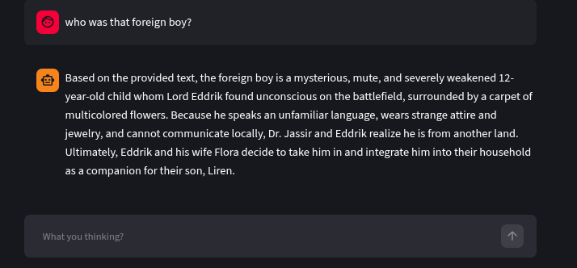

# The AI Novel Tracking Project
**Note:This project is built for someone who likes to write novel but having hard timing remembering lore,event,character etc.**

## What it does?
It does one thing. You copy your novel here and the AI agent reads it then save it to the database(with vector embeddings). So when you ask the AI about something that remained somewere in old chapters, the AI finds it and answers accordingly.

## The chatbot answering correctly about my novel

## The project structure
You create a novel and chapters here then the steps go like this,
1. Summary Agent reads your chapter whenever you insert them as .txt file(docx,pdf will be supported in later version). This summary agent plays the most crucial role in this project. It reads your long chapter and gets the necessary info and put them together as a summary.
2. Then the embedding agent starts reading the summary and save it to the supabase cloud database.
3. Whenever you click on any chapter you get chatbot interface where u can ask something you should remember right now from your old chapters(the ai does the vector search to find relevant data).

**Remember:The AI isn't 100% correct always. It was built for as an writer's own librarian**
